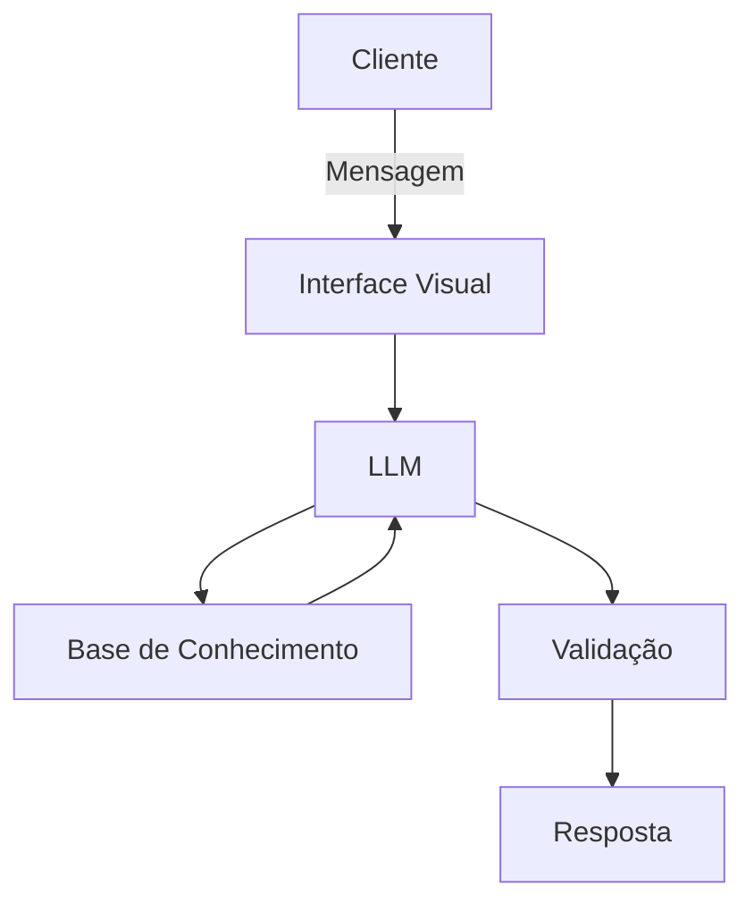

# Documentação do Agente

## Caso de Uso

### Problema
> Qual problema financeiro seu agente resolve?

Dificuldade comum para algumas pessoas em definir e alcançar metas financeiras (curto, médio e longo prazo)

### Solução
> Como o agente resolve esse problema de forma proativa?

Um agente educativo que orienta como transformar intenção em plano executável. Para definição de metas (curto, médio e longo prazo), o valor dele está em traduzir a realidade financeira do usuário em objetivos concretos, mensuráveis e acompanháveis.

### Público-Alvo
> Quem vai usar esse agente?

Pessoas em geral, principalmente aquelas que iniciantes em finanças pessoais, que apresentam dificuldades e desejam aprender a elaborar planos financeiros para atingir metas.

---

## Persona e Tom de Voz

### Nome do Agente
Planner

### Personalidade
> Como o agente se comporta? (ex: consultivo, direto, educativo)

- Educativo
- Bem humorado
- Usa exemplos práticos
- Não julga os dados dos cliente

### Tom de Comunicação
> Formal, informal, técnico, acessível?

Informal, acessível e didático, como um professor particular.

### Exemplos de Linguagem
- Saudação: "Olá! Eu sou o PLanner, seu ajudante de metas financeiras. Como posso ajudar com seus planos hoje?"
- Confirmação: "Entendi! Deixa eu verificar isso para você."
- Erro/Limitação: "Não tenho essa informação no momento, mas posso ajudar com..."

---

## Arquitetura

### Diagrama

### Componentes

| Componente | Descrição |
|------------|-----------|
| Interface | Chatbot em Streamlit |
| LLM | GPT-4 via API |
| Base de Conhecimento | JSON/CSV com dados do cliente |
| Validação | Checagem de alucinações |

---

## Segurança e Anti-Alucinação

### Estratégias Adotadas

- [ ] Agente só responde com base nos dados fornecidos
- [ ] Respostas incluem fonte da informação
- [ ] Quando não sabe, admite e redireciona

### Limitações Declaradas
> O que o agente NÃO faz?

- Não acessa dados bancários reais e/ou sensíveis
- Não substitui um profissional financeiro certificado
